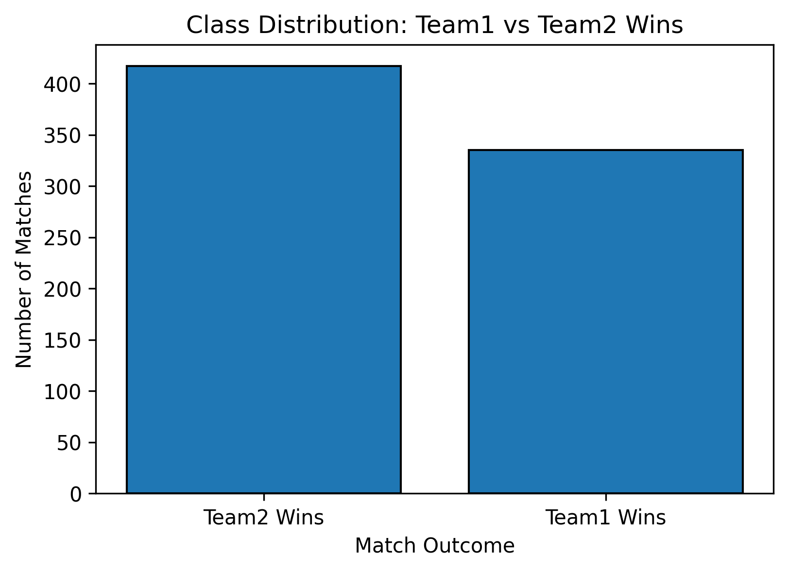
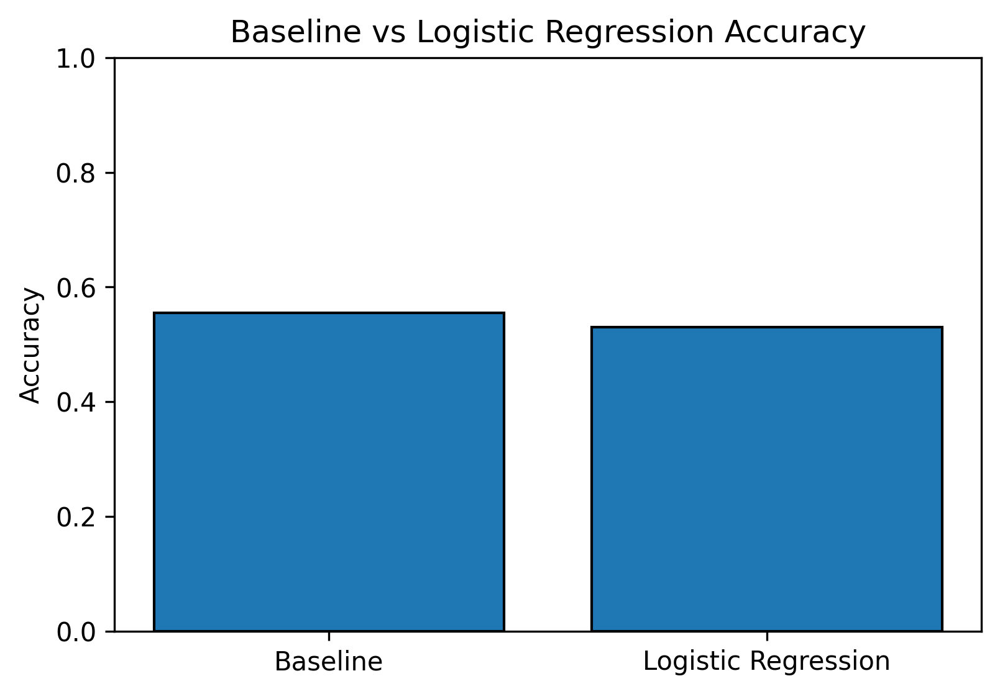

# IPL Match Outcome Prediction

## Overview
This project explores whether IPL match outcomes can be predicted using only **pre-match information** such as teams, venue, and toss details.  
The objective is not to achieve high accuracy, but to understand the **limitations of machine learning models** when applied to noisy real-world sports data.

## Dataset
The dataset contains historical IPL match-level data including:
- Team 1 and Team 2
- Match venue
- Toss winner and toss decision
- Match winner

Only **pre-match features** were used to avoid any form of data leakage.

## Problem Framing
The task is framed as a **binary classification problem**:
- **1** → Team 1 wins the match  
- **0** → Team 2 wins the match  

Matches with missing or undefined winners were removed during preprocessing.

## Approach
- Categorical features were encoded using **one-hot encoding**
- A **baseline accuracy** was computed using a majority-class strategy
- **Logistic Regression** was used as a simple and interpretable baseline model
- A **stratified train-test split** was applied to handle slight class imbalance

## Exploratory Insights

### Class Distribution
This plot shows the distribution of match outcomes between Team 1 and Team 2 wins.  
The slight imbalance justifies the use of stratified sampling during evaluation.

### Baseline vs Model Performance
This comparison shows that Logistic Regression only marginally outperforms a naive baseline, highlighting the limited predictive power of pre-match features.

## Results
The trained model achieved an accuracy only slightly higher than the baseline, indicating that match outcomes are influenced by many factors not available before the match begins.

## Key Takeaway
Pre-match features alone are **insufficient for reliable IPL match outcome prediction**.  
This project emphasizes the importance of baseline evaluation and honest assessment when applying machine learning to high-variance real-world problems.

## Tools Used
- Python
- Pandas
- NumPy
- Scikit-learn
- Matplotlib

## Future Work
- Incorporating historical team performance metrics
- Player-level statistics
- Time-aware validation strategies

