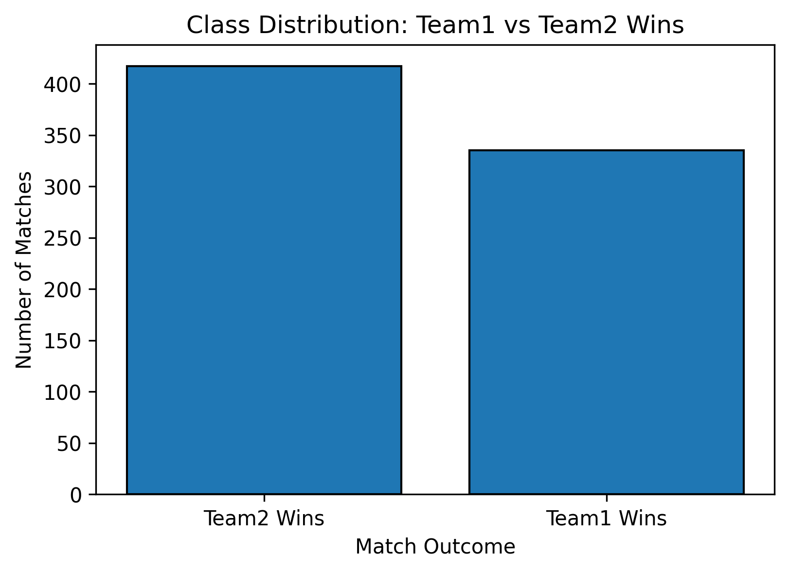
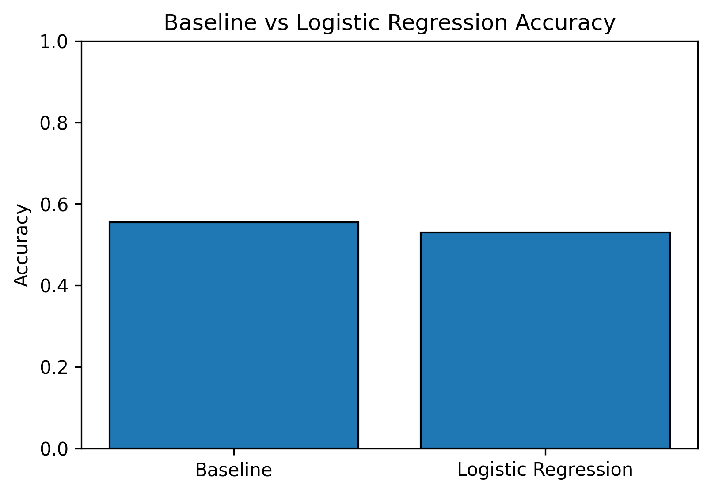
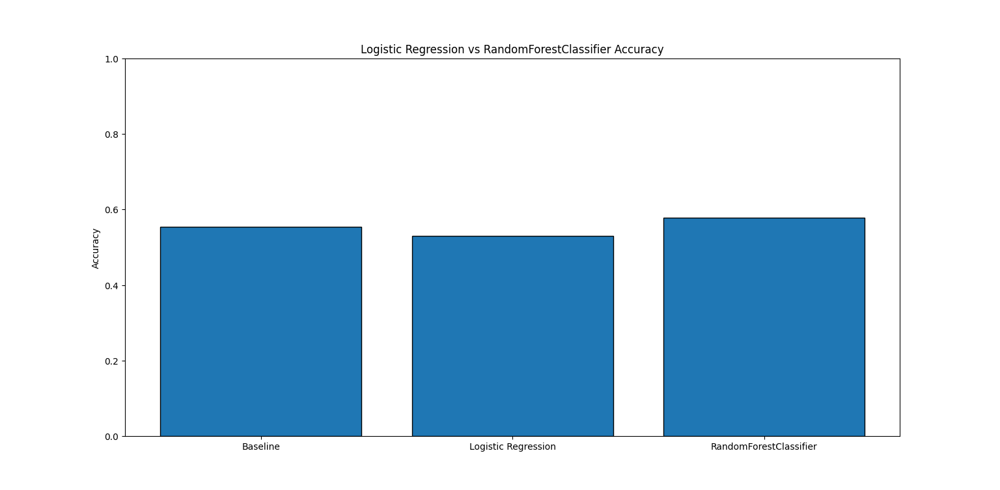

# IPL Match Outcome Prediction

## Overview
This project explores whether IPL match outcomes can be predicted using **pre-match match information** and **historical engineered features**.

The objective of this project was not simply to maximize accuracy, but to understand:

- how much predictive power basic match data really has,
- how feature engineering can improve a model,
- and why honest evaluation matters in real-world machine learning problems.

This project focuses on building a **realistic and explainable ML workflow** instead of chasing unrealistic results.

---

## Problem Statement
The task is framed as a **binary classification problem**:

- **1 → Team 1 wins the match**
- **0 → Team 2 wins the match**

Only information available **before the match starts** was used, in order to avoid future data leakage.

---

## Dataset
The dataset contains historical IPL match-level data including:

- Team 1
- Team 2
- Venue
- Toss Winner
- Toss Decision
- Match Winner
- Match Date

Rows with missing or undefined winners were removed during preprocessing.

---

## Features Used

### Raw Match Features
- Team 1
- Team 2
- Venue
- Toss Winner
- Toss Decision

### Engineered Features
The model was later improved by adding historical features calculated using **only past matches**:

- **Team 1 Win Rate**
- **Team 2 Win Rate**
- **Team 1 Recent Form (Last 5 Matches)**
- **Team 2 Recent Form (Last 5 Matches)**
- **Team 1 Head-to-Head Win Rate**
- **Team 2 Head-to-Head Win Rate**

These features were built dynamically using dictionaries and chronological match history.

---

## Machine Learning Approach

### Models Used
- **Baseline Model** (majority-class prediction)
- **Logistic Regression**
- **Random Forest Classifier**

### Workflow
- Data cleaning and preprocessing
- Team name standardization
- Chronological sorting by date
- Feature engineering using only past match information
- One-hot encoding for categorical variables
- Train-test split with stratification
- Accuracy-based evaluation

---

## Exploratory Insights

### 1. Class Distribution
This graph shows the distribution of the target variable:

- **1 = Team 1 wins**
- **0 = Team 2 wins**

This helps check whether the dataset is balanced or slightly imbalanced.



---

### 2. Baseline vs Initial Model Comparison
This graph compares the **baseline model** with the initial machine learning model.

It helps show how much predictive power exists when using only basic match information.



---

### 3. Final Model Accuracy Comparison
This graph compares:

- **Baseline Model**
- **Logistic Regression**
- **Random Forest Classifier**

after adding feature engineering improvements such as win rate, recent form, and head-to-head win rate.



---

## Results

### Final Accuracy Comparison
- **Baseline Accuracy:** `REPLACE_THIS`
- **Logistic Regression Accuracy:** `REPLACE_THIS`
- **Random Forest Accuracy:** `0.57`

> Replace the values above with your actual baseline and logistic regression scores.

---

## Key Learnings
This project helped me understand several important machine learning concepts:

- Why **feature engineering matters more than simply changing models**
- How to create **past-only historical features**
- Why **future data leakage must be avoided**
- How to use **dictionaries, loops, and match history** to build dynamic ML features
- Why sports prediction is difficult due to uncertainty and hidden variables

---

## Honest Conclusion
This project showed that IPL match outcome prediction is a challenging problem.

Even after adding engineered historical features, model performance improved only moderately. This suggests that IPL outcomes are influenced by many factors not present in the dataset, such as:

- player availability
- injuries
- current form
- pitch conditions
- team combinations
- match-day randomness

So the main value of this project is not “high accuracy,” but learning how to build a more realistic and honest machine learning pipeline.

---

## Tools Used
- Python
- Pandas
- NumPy
- Matplotlib
- Scikit-learn

---

## File Structure
```bash
ipl-match-outcome-prediction/
│
├── LICENSE
├── README.md
├── ipl.py
├── matches.csv
├── class_distribution.png
├── model_accuracy_comparison.png
├── accuracy_comparison.png
